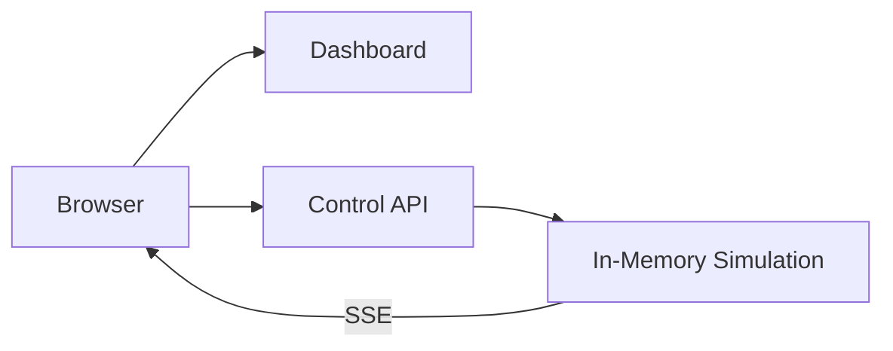

# Architektur


Das Dashboard und die Control API laufen als getrennte Deployments. Die Control API besitzt vorerst den In-Memory-Zustand und führt die Simulation aus.



## Komponenten

| Komponente | Pfad | Technik | Port | Aufgabe |
| --- | --- | --- | --- | --- |
| `dashboard` | `apps/dashboard` | Nuxt 4, PixiJS | 3000 | Rendert die 21x21-Tile-Stadt, konsumiert Snapshot und Event-Stream |
| `control-api` | `cmd/control-api`, `internal/*` | Go 1.25 | 8080 | Simulation, REST, SSE, Health, Metrics |

Der Browser spricht beide Komponenten direkt an. Das Dashboard erhält die API-Adresse über `NUXT_PUBLIC_API_BASE`; ein serverseitiger Proxy existiert bewusst nicht, deshalb setzt die API CORS-Header (`internal/api/server.go`).

## Control API

`cmd/control-api/main.go` liest `APP_MODE`, `TICK_MS` und `POD_NAME` aus der Umgebung, baut die Engine und startet zwei Goroutinen: den Simulations-Ticker (`engine.Run`) und den HTTP-Server. `SIGINT`/`SIGTERM` lösen einen Shutdown mit 5 s Frist aus.

| Endpunkt | Zweck |
| --- | --- |
| `GET /api/v1/snapshot` | Vollständiger Weltzustand als JSON |
| `GET /api/v1/events` | SSE-Stream mit Domain-Events, Heartbeat alle 15 s |
| `POST /api/v1/simulation/start\|pause\|reset` | Steuerung der Simulation |
| `POST /api/v1/orders` | Manuelle Bestellung erzeugen |
| `GET /health/live`, `GET /health/ready` | Probes |
| `GET /metrics` | Prometheus-Textformat |

### Zustand und Nebenläufigkeit

Die `Engine` (`internal/simulation/engine.go`) hält Restaurants, Kunden, Kuriere und Bestellungen in Maps hinter einem `sync.RWMutex`. Jeder Tick bewegt Kuriere entlang der Strassen und emittiert Events an alle Subscriber (gepufferte Channels, ein Channel pro SSE-Verbindung). Der Zustand ist ausschliesslich prozesslokal — das ist der Grund für `replicas: 1`.

### Event-Vertrag

Alle Events nutzen denselben Umschlag (`model.EventEnvelope`): `event_id`, `event_type`, `event_version`, `occurred_at`, `correlation_id`, `causation_id`, `source`, `payload`. Typen sind unter anderem `order.created`, `order.accepted`, `courier.assigned`, `courier.location.updated`, `order.picked_up`, `order.delivered`. `events.RoutingKey` liefert bereits heute einen Topic-Schlüssel, obwohl noch kein Broker existiert — der Vertrag ist auf spätere Blöcke ausgelegt.

## Dashboard

`useDeliveryApi()` lädt beim Mount einen Snapshot, öffnet danach die `EventSource` und pollt zusätzlich alle 5 s als Fallback. Eingehende Events werden gesammelt (max. 40, `courier.location.updated` pro Quelle dedupliziert) und lösen einen entprellten Snapshot-Refresh nach 180 ms aus. Der Event-Stream treibt also die Darstellung an, der Snapshot bleibt die Quelle der Wahrheit.

## Deployment

```
deploy/
  base/                          Namespace, ConfigMap, je Deployment + Service
  overlays/block-03-standalone/  ergänzt Label course.teko.ch/block: "03"
```

Beide Services zeigen über `targetPort: http` auf den benannten Container-Port und selektieren via `app.kubernetes.io/name`. Die ConfigMap `simulation-config` wird per `envFrom` in die Control API injiziert — da Umgebungsvariablen nur beim Containerstart gelesen werden, benötigt eine Änderung an `TICK_MS` ein `kubectl rollout restart`.

Images entstehen aus zwei Multi-Stage-Dockerfiles (`build/go-service.Dockerfile` auf Distroless, `apps/dashboard/Dockerfile` auf `node:24-alpine`), werden mit Tag `local` gebaut und per `k3d image import` in den Cluster geladen. `imagePullPolicy: IfNotPresent` verhindert einen Registry-Pull.

## Bekannte Grenzen

- Kein geteilter Zustand: `control-api` skaliert nicht horizontal.
- Kein Ingress: Zugriff erfolgt über `port-forward`.
- Keine Persistenz: ein Neustart verliert alle Bestellungen (`Hydrate` ist für spätere Blöcke bereits vorbereitet).
=======
