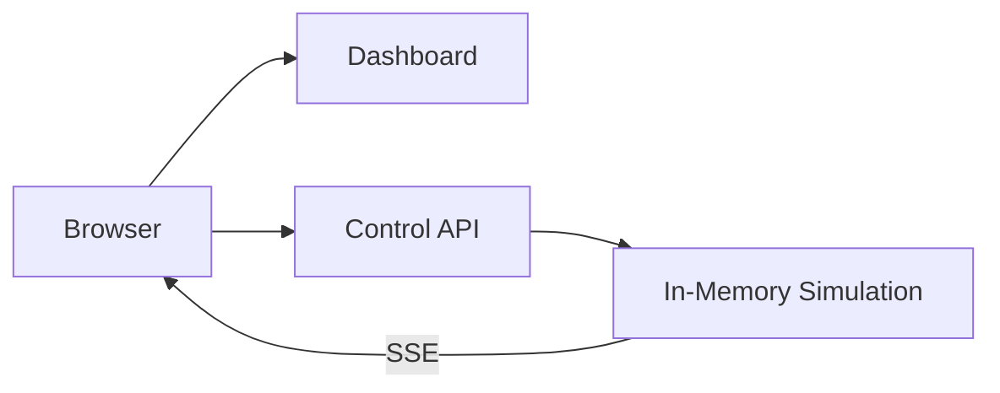
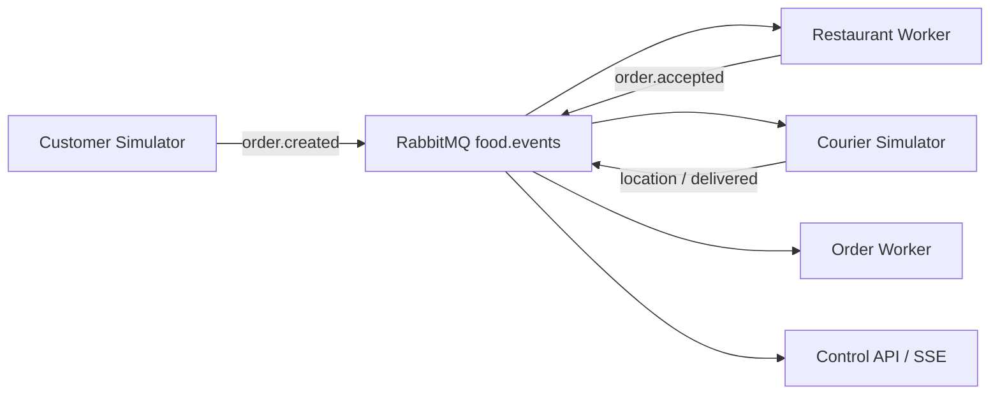
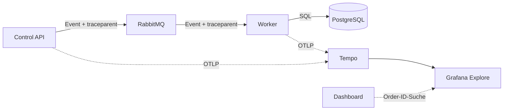

# Architektur

## Block 3: Standalone

Das Dashboard und die Control API laufen als getrennte Deployments. Die Control API besitzt vorerst den In-Memory-Zustand und führt die Simulation aus.

Die bewusste Einschränkung ist sichtbar: `control-api` darf noch nicht horizontal skaliert werden. Mehrere Replicas hätten voneinander abweichende Zustände. Messaging und Persistenz lösen dies in späteren Blöcken.

## Block 4: Ingress und Load Balancing

Traefik veröffentlicht Dashboard und API unter einem gemeinsamen Einstiegspunkt:

- `/` wird zum `dashboard`-Service geroutet.
- `/api`, `/health` und `/metrics` werden zum `control-api`-Service geroutet.
- Zwei Dashboard-Pods zeigen das Load Balancing des Services.
- Die Control API bleibt wegen des In-Memory-Zustands bei einer Replica.

## Block 5: Messaging

RabbitMQ entkoppelt die fachliche Verarbeitung:

Die Verarbeitung ist at-least-once. Der Order Worker besitzt in diesem Block nur einen lokalen Idempotenzspeicher. Ein Pod-Neustart zeigt deshalb bewusst die noch offene Persistenzlücke.

## Block 6: CloudNativePG und Persistenz

Der Order Worker ist der einzige Schreiber des fachlichen Zustands. Er verarbeitet jedes Event mit einer PostgreSQL-Transaktion:

1. `event_id` in `processed_events` beanspruchen.
2. Fachliche Zustandsänderung projizieren.
3. Relevantes Event in `order_events` ablegen.
4. Transaktion committen und erst danach die RabbitMQ-Nachricht bestätigen.

Die Anwendungen verwenden den von CloudNativePG verwalteten `food-delivery-db-rw`-Service. Dieser zeigt nach einem Failover automatisch auf den neuen Primary.

## Block 7: Observability und Resilienz

Prometheus sammelt Metriken von den Workloads und RabbitMQ. Grafana stellt
Metriken und das Betriebs-Dashboard bereit. Der Cluster Observer ergänzt den
fachlichen Zustand um die tatsächlichen Kubernetes-Replica- und Ready-Zahlen.
Failure- und Skalierungsdemos zeigen, wie Rückstau, Readiness und Rollouts
zusammenwirken.

## Optionale Erweiterung: Distributed Tracing

Distributed Tracing ist kein eigener Block, sondern eine freiwillige Erweiterung
des Observability-Stands. OpenTelemetry instrumentiert die Control API,
RabbitMQ und die PostgreSQL-Zugriffe des Order Workers. Der W3C-Kontext läuft
über AMQP-Header, während `correlation_id` als unveränderte fachliche Order-ID
im Event bleibt. Grafana Explore und der optionale Dashboard-Link machen eine
einzelne Bestellung über mehrere Services nachvollziehbar. Die vollständige
Beschreibung mit Betriebs- und TraceQL-Beispielen steht in
[docs/tracing.md](tracing.md).

Die durchgezogenen Kanten sind der fachliche Ablauf. Die gestrichelten Kanten
sind ausschließlich Telemetrie: Sie ändern weder Event-Payload noch
Geschäftslogik.
