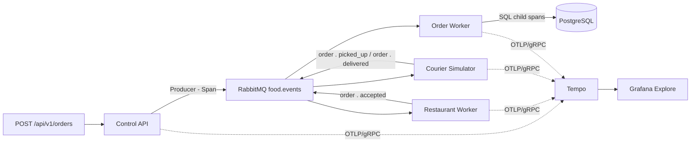

# Optionale Erweiterung: Distributed Tracing

> Technisch sinnvolle und nachvollziehbar integrierte Erweiterungen, die über
> die vorgegebenen Anforderungen hinausgehen. Art und Umfang werden durch die
> Lehrperson individuell beurteilt.

Distributed Tracing ist in diesem Projekt kein eigener Kursblock. Es ist eine optionale Erweiterung des
Observability-Stands aus Block 7, mit der sich eine Bestellung über mehrere Prozesse, RabbitMQ und PostgreSQL verfolgen
lässt. Block 7 bleibt ohne diese Erweiterung reproduzierbar.

## Zweck und Abgrenzung

Die Erweiterung beantwortet eine andere Frage als die Metriken aus Block 7:

- Metriken zeigen, **dass** sich ein Systemzustand verändert, zum Beispiel ein wachsender RabbitMQ-Rückstau.
- Traces zeigen, **wie** eine einzelne Bestellung durch die verteilte Anwendung gelaufen ist und wo Zeit oder Fehler
  entstanden sind.

Das bestehende Event-Schema bleibt unverändert. Der technische W3C-Kontext wird nicht in das JSON-Payload geschrieben,
sondern über die AMQP-Header
`traceparent` und `tracestate` weitergegeben. Die fachliche
`correlation_id` bleibt die Order-ID.

## Architektur



Instrumentiert sind:

- HTTP-Server-Spans der Control API
- RabbitMQ-Producer- und Consumer-Spans inklusive Event-Typ, Queue und Routing
- PostgreSQL-Spans des Order Workers
- Ressourcenattribute wie `service.name`, Namespace und Pod-Instanz

Health, Metrics, Snapshot-Polling und der langlebige SSE-Stream werden bewusst nicht als dauerhafte Business-Traces
exportiert. Wenn Tempo ausfällt, bleibt die Fachanwendung funktionsfähig; es fehlen nur die exportierten Spans.

## Optionalen Ausbau starten

Der normale Zielstand endet bei Block 7. Nach dem normalen Build und Deploy wird der Ausbau ausdrücklich separat
aktiviert:

```bash
sh scripts/deploy-final.sh
sh scripts/deploy-tracing.sh
kubectl --context k3d-delivery-lab -n monitoring port-forward service/monitoring-grafana 3000:80
```

`deploy-tracing.sh` installiert Tempo, provisioniert die Tempo-Datenquelle in Grafana und aktiviert
`deploy/overlays/optional-tracing`. Die Trace-Aufbewahrung ist für die lokale Demo kurz gehalten. Tempo wird nicht
öffentlich exponiert.

Das Dashboard erhält durch das optionale Overlay nach Abschluss einer Bestellung einen externen Link am Order-Eintrag.
Er öffnet Grafana Explore mit einer vorbereiteten TraceQL-Suche für die vollständige Order-ID. Die Spans werden lokal
spätestens nach rund 200 ms exportiert. Ohne das Overlay bleibt der Link verborgen.

## Eine Bestellung verfolgen

### 1. Bestellung erzeugen

Über den Ingress:

```bash
ORDER_JSON=$(curl --fail --silent --request POST http://localhost:8080/api/v1/orders)
ORDER_ID=$(printf '%s' "$ORDER_JSON" | jq -r '.id')
printf 'Order-ID: %s\n' "$ORDER_ID"
```

Falls kein Ingress verwendet wird, zuerst die Control API weiterleiten:

```bash
kubectl --context k3d-delivery-lab -n food-delivery port-forward service/control-api 8081:8080
ORDER_JSON=$(curl --fail --silent --request POST http://localhost:8081/api/v1/orders)
ORDER_ID=$(printf '%s' "$ORDER_JSON" | jq -r '.id')
```

Nach dem Status `Geliefert` oder `Fehlgeschlagen` erscheint in der Bestellliste das External-Link-Symbol. Es öffnet
Grafana Explore mit einer Suche nach dieser Order. Die verkürzte Anzeige `#ABC1234` ist nur eine Darstellung; die Suche
verwendet die vollständige UUID.

Die [Demo-Aufnahme](demo/09-tracing.png) zeigt die ausgewählte Bestellung im Dashboard, die TraceQL-Suche und den
resultierenden Trace in Grafana Explore.

### 2. Trace in Grafana öffnen

Grafana unter <http://localhost:3000> mit `admin` / `delivery` öffnen. Der Link aus dem Dashboard führt zu Explore.
Alternativ in Explore die Datenquelle
`Tempo`, den Modus `TraceQL` und diese Suche verwenden:

```traceql
{ span.food_delivery.correlation_id = "ORDER_ID" }
```

`ORDER_ID` durch die vollständige UUID ersetzen. In einem gefundenen Trace sind unter anderem diese Stationen sichtbar:

- `POST /api/v1/orders`
- `rabbitmq.publish order.created`
- `rabbitmq.consume order.accepted`
- `courier.assigned` und `order.picked_up`
- `rabbitmq.publish order.delivered`
- `rabbitmq.consume order.delivered`
- PostgreSQL-Spans des Order Workers

Bei RabbitMQ-Fan-out können mehrere Consumer-Zweige im selben Trace erscheinen. Das ist fachlich korrekt: Ein Event wird
an mehrere passende Queues zugestellt. Eine abgelehnte Bestellung ist mit derselben Suche ebenfalls sichtbar. Ihr
Endpunkt ist `order.rejected` statt `order.delivered`; die fachliche Ablehnung ist kein technischer Trace-Fehler.

### 3. TraceQL-Beispiele

Alle Control-API-Aufträge:

```traceql
{ resource.service.name = "control-api" && name = "POST /api/v1/orders" }
```

Nur RabbitMQ-Verarbeitung:

```traceql
{ span.messaging.system = "rabbitmq" }
```

Traces mit dem Zustellungsereignis:

```traceql
{ span.food_delivery.event.type = "order.delivered" }
```

Langsame Gesamt-Traces:

```traceql
{ trace:duration > 5s }
```

Tempo-Attribute mit Punkten im Namen werden als durch Punkt getrennte TraceQL- Pfade geschrieben, zum Beispiel
`span.food_delivery.event.type`. String-Werte gehören in Anführungszeichen.

### 4. Query-API für Diagnose

Für eine CLI-Abfrage kann die Tempo-API weitergeleitet werden:

```bash
kubectl --context k3d-delivery-lab -n monitoring port-forward service/tempo 3200:3200
curl --fail --silent --get http://localhost:3200/api/search \
  --data-urlencode "q={ span.food_delivery.correlation_id = \"${ORDER_ID}\" }" \
  | jq '.traces[] | {traceID, rootServiceName, startTimeUnixNano}'
```

Die zurückgegebene `traceID` ist eine technische Tempo-ID. Sie ist absichtlich nicht identisch mit der fachlichen
`ORDER_ID` beziehungsweise
`food_delivery.correlation_id`.

## Nachweis und Grenzen

Ein nachvollziehbarer Nachweis besteht aus einer manuellen Bestellung, dem Dashboard-Link und dem geöffneten Trace mit
Control API, RabbitMQ, Restaurant, Courier, Order Worker und PostgreSQL. Für eine lokale Lernumgebung sind folgende
Vereinfachungen bewusst gewählt:

- ein einzelner monolithischer Tempo-Pod
- lokale Tempo-Speicherung mit kurzer Retention
- kein öffentlicher Tempo-Ingress
- kein OTel Collector und keine Loki-Trace-to-Logs-Korrelation

skipped: OTel Collector, Loki und zentrale Sampling-Regeln; add when:
produktionähnliche Ausfallsicherheit oder eine Signal-Korrelation über mehrere Monitoring-Systeme benötigt wird.
